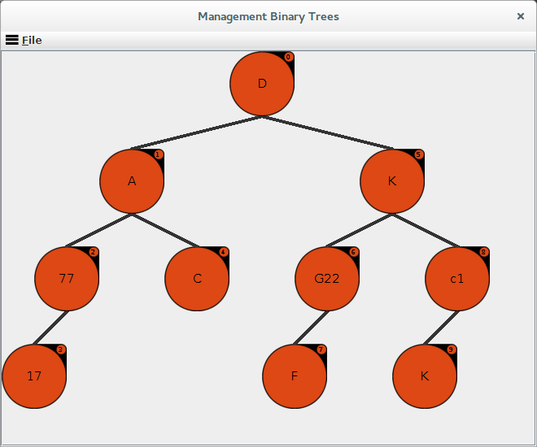
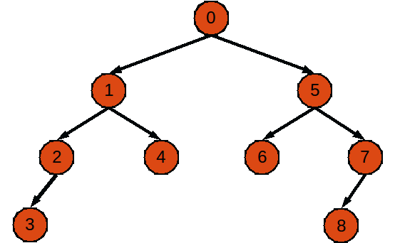

# ManagementBinaryTrees
Beleg für Programmieren - Zum Verwalten und Darstellen von Binärbäumen

Das Programm "ManagementBinaryTrees" ist ein grafisches Programm, welches dazu dient Knoten in einem
Binärbaum ein zu fügen, zu verändern und zu entfernen.

Außerdem bietet es die Möglichkeit die Binärbaume
in eine Json Datei zu speichern und laden und zu sortieren.

Nach dem Start wird ein generierter Binärbaum angezeigt, der nach belieben bearbeite oder ausgetauscht
werden kann.

In den Menü welches sich unter den Button "File" verbirgt, ist es möglich Binärbaume zu laden, speicher,
neu an zu legen, zu sortieren und das Programm zu schließen.

Das Projekt wurde mit JUnit 4 tests getestete und die test Klassen befinden sich bei den Quellcode dabei.



# Kompilieren

Im Rootverzeichnis des Projektes im Terminal wechseln und ```mvn clean install``` eingeben.
Damit werden alle Maven 2 abhänigkeiten automatisch heruntergeladen, tests ausgeführt und wenn die Test fehlerfrei
verlaufen wird die unter `target/ManagementBinaryTrees-0.1.jar` ausgegeben.

Zum ausführen:
```bash
java -jar target/ManagementBinaryTrees-0.1.jar
```

# Dokumentation

https://github.com/linuxluigi/ManagementBinaryTrees/blob/master/docs/source/index.rst

# Build & Develop
Mit IntelliJ IDEA von Stefen Exler 

