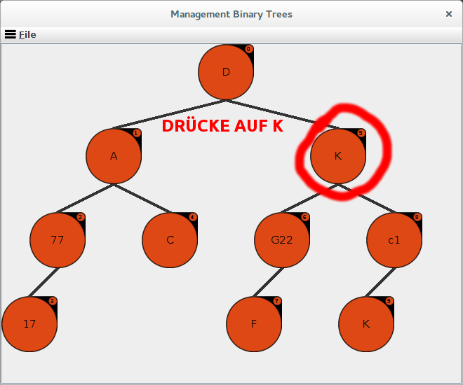
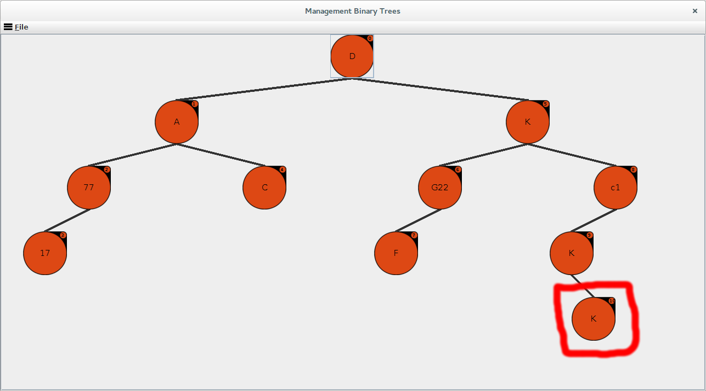
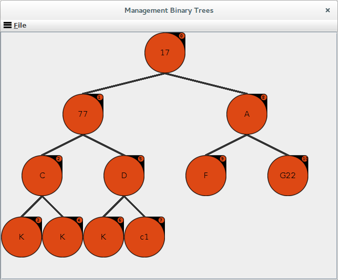
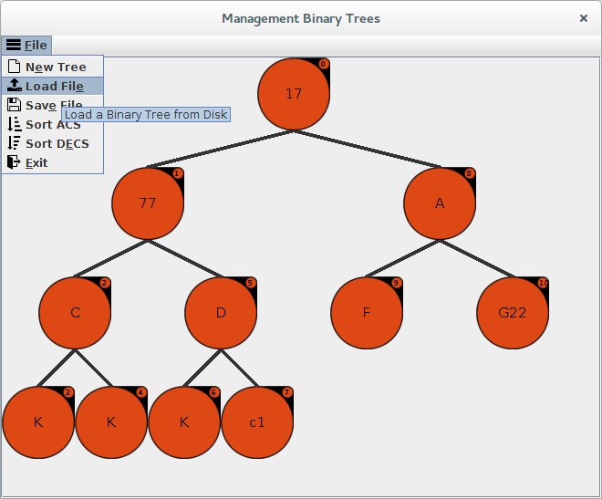

User Interface
==============

Bedienung
^^^^^^^^^
Nach dem Start des Programmes wird ein Beispiel Binärbaum erstellt, wobei jeder Knoten ein Button ist.
Diese Button dienen dazu die Knoten zu bearbeiten, neue ein zu fügen und zu löschen

Nachdem ein Button gedrück worden ist erscheint ein extra Fenster welches die Optionen besitzt "ADD",
"RENAME" und "REMOVE". Wohinter sich die Aktionen "ADD" >> Hinzufügen, "RENAME" >> "Name Ändern" und "REMOVE" >>
Knoten entfernen verbergen.

Das Textfeld gibt den Aktuellen inhalt des Knotens wieder. Wenn dieses geändert wird und auf "RENAME" geklickt wird,
ändert sich der Inhalt von den Knoten und wenn auf "ADD" geklickt wird, wird ein neuer Knoten mit den Wert der in dem
Textfeld enthalten ist hinzugefügt.

Knoten hinzufügen
^^^^^^^^^^^^^^^^^

Nachdem auf ein Knoten geklickt worden ist, ist es möglich in den Dialog Fenster, welches erscheint.
Den neuen Knoten ein 3 Stelligen Wert zu zu Ordnen und ihn nach dem angeklickten Knoten ein zu fügen.

In diesen Beispiel erscheint nun unten Links der neue Knoten.

Binärbaum Sortieren
^^^^^^^^^^^^^^^^^^^

Um ein Binärbaum zu sortieren muss auf geklickt werden auf "FILE" >> "Sort ACS" oder "Sort DECS"

In diesen Beispiel sieht der Baum danach so aus:

Datei Laden und Sichern
^^^^^^^^^^^^^^^^^^^^^^^

.. index:: Json Laden und Sichern

Um ein Binärbaum zu sichern oder laden muss auf geklickt werden auf "FILE" >> "Load File" oder "Save File"

Und in den folgenden Fenster die gewünschte Json Datei auswählen.

Hier ist eine Beispiel Json Datei.

.. code-block:: json

    [
      ["","GHS"],
      ["0","45z"],
      ["00","439"],
      ["01","546"],
      ["1","ksd"],
      ["10","Pkk"],
      ["101","ZZZ"],
      ["11","lij"]
    ]

Konvertiert in ein Binärbaum sieht es folgend aus:

