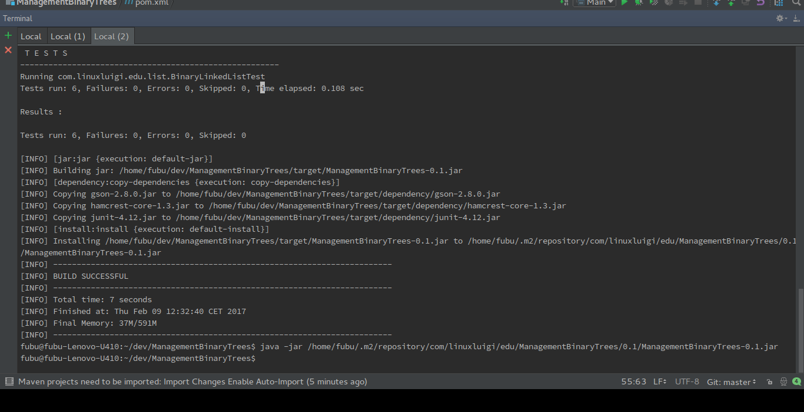

Über das Programm
-----------------
Das Programm "ManagementBinaryTrees" ist ein grafisches Programm, welches dazu dient Knoten in einem
Binärbaum ein zu fügen, zu verändern und zu entfernen.

Außerdem bietet es die Möglichkeit die Binärbaume
in eine Json Datei zu speichern und laden und zu sortieren.

Nach dem Start wird ein generierter Binärbaum angezeigt, der nach belieben bearbeite oder ausgetauscht
werden kann.

In den Menü welches sich unter den Button "File" verbirgt, ist es möglich Binärbaume zu laden, speicher,
neu an zu legen, zu sortieren und das Programm zu schließen.

Das Projekt wurde mit JUnit 4 tests getestete und die test Klassen befinden sich bei den Quellcode dabei.

- Quellcode: https://github.com/linuxluigi/ManagementBinaryTrees
- Online Dokumentation: https://github.com/linuxluigi/ManagementBinaryTrees/blob/master/docs/source/index.rst
.. index:: Git
.. index:: Quellcode
.. index:: Online Dokumentation

.. image:: _static/img/ManagementBinaryTrees_01.png

Kompilieren
-----------
.. index:: Kompilieren
.. index:: Build
.. index:: Build Artifacts
.. index:: Maven

Das Projekt wurde via Maven 2 konstruiert und kann mit ein Konsolen Befehl in einer Jar Datei Kompiliert werden, dafür
muss aber zuerst Maven 2 installiert werden, unter Ubuntu / Debian muss folgendes eingeben werden.

.. code-block:: bash

   $ sudo apt-get install maven2

Jetzt wurde Maven 2 installiert und nun kann das Projekt die abhänigkeiten installiert werden, test ausgeführt und
zur einer ausführbaren Jar ausgeben.

.. code-block:: bash

   $ mvn clean install

Abhänigkeiten
-------------
.. index:: Abhänigkeiten
Das Projekt wurde als Maven 2 Modul geschrieben und verwendet folgende Maven Module.

Maven Projekt Website: https://maven.apache.org/

Google GSON
^^^^^^^^^^^
.. index:: Google GSON
Gson ist eine Java Bibliothek die es ermöglicht Klassen und Variablen als Json Datei aus zu geben oder
ein String als Klasse oder Variable zu konvertieren.

| Name: google-gson
| Hersteller: Google Inc.
| Version: 2.7
| Link: https://github.com/google/gson

JUnit
^^^^^
.. index:: JUnit
Junit ist ein unit testing Framework für Java von Erich Gamma und Kent Beck.

| Name: JUnit
| Hersteller: Erich Gamma und Kent Beck
| Version: 4.12
| Link: http://junit.org/junit4/